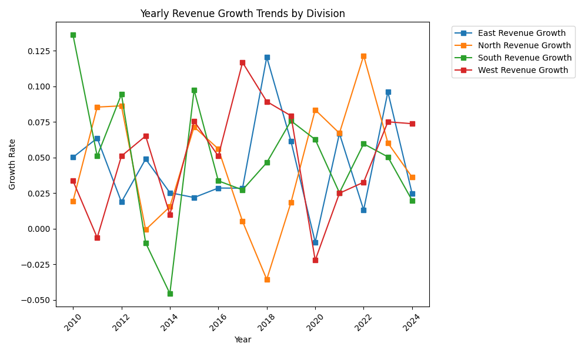

# Financial Planning and Analysis (Using Python)

## Overview

This project focuses on financial planning and analysis for an electronics company. The project includes calculating annual budgets, forecasting future profits, and analyzing trends in revenue, expense, and profit across different divisions.

## Data Preparation

### Generating Synthetic Data:
- Generate synthetic sales data for various divisions and products.
- Create synthetic data for 5000 rows with columns like Date, Division, Product, Revenue, Expense, Profit, and other financial metrics.

## Financial Analysis

### Annual Budget Calculator:
- Calculates the annual budget for each division based on historical revenue and expense data.

### Profit Forecasting:
- Forecasts future profits based on current revenue and expense data.

### Trend Analysis:
- Analyzes and plots trends in revenue, expense, and profit for each division over the years.

## Visualizations

### Revenue Growth Trends:
- **Description**: Plot the yearly revenue growth trends for each division.
- **Visualization**:
  

### Expense Growth Trends:
- **Description**: Plot the yearly expense growth trends for each division.
- **Visualization**:
  

### Profit Growth Trends:
- **Description**: Plot the yearly profit growth trends for each division.
- **Visualization**:
  

## Conclusion

This project provides tools for comprehensive financial analysis, including budget calculations, profit forecasting, and trend analysis. The visualizations help in understanding the financial performance and trends across different divisions, enabling data-driven decision-making.

## References:
1. Financial data and analysis techniques adapted from industry standards.
2. Synthetic data generation inspired by real-world financial datasets.
